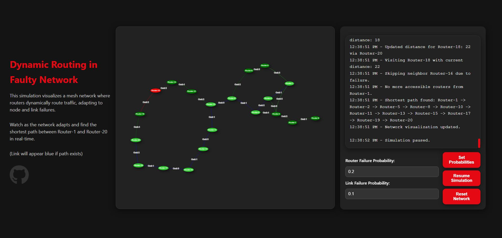

# Dynamic Network Simulation | COMP 177 Final Project

## Overview

This project is a dynamic webpage simulation of a mesh network, designed to demonstrate routing through a network that adapts to node and link failures. It visualizes how routers within the network automatically reconfigure and find the shortest path between specified nodes (e.g., Router-1 and Router-20). The simulation also allows users to adjust failure probabilities for both routers and links to observe the impact on routing.

### Demo


Try the live demo [here](https://wes-brook.github.io/Dynamic-Network-Simulator/)!

## Features
- **Real-time Network Visualization**: Watch how routers adapt to changes in the network, such as node and link failures.
- **Router and Link Failure Simulation**: Configure the probability of router and link failures, and observe how the network reacts.
- **Interactive Controls**: 
  - Set the probability of router failures.
  - Set the probability of link failures.
  - Pause or reset the simulation.
- **Shortest Path Highlighting**: Links between routers are displayed in blue if a path exists between them.
  
## Technologies Used
- **HTML5**: For structuring the content and layout of the web application.
- **CSS3**: For styling and responsive design.
- **JavaScript**: For implementing the simulation logic and handling interactions.
- **Vis.js**: A JavaScript library used for dynamic network graph visualization.

## How It Works

1. **Visualization**: The simulation visualizes a mesh network where nodes represent routers, and links represent communication paths between routers.
2. **Simulation Logic**: The system randomly selects routers and links to fail based on the configured failure probabilities. The network adapts in real-time, dynamically rerouting traffic **(Dijkstra's Algorithm)**.
3. **Interactivity**: Users can change the failure probabilities for both routers and links and see how this affects the overall network behavior.

## Setup Instructions

To run the simulation locally, follow these steps:

### Prerequisites
- A modern web browser (Google Chrome, Mozilla Firefox, etc.)

### Steps
1. **Clone the repository**:
    ```bash
    git clone https://github.com/your-username/network-simulation.git
    ```
2. **Navigate to the project directory**:
    ```bash
    cd network-simulation
    ```
3. **Open `index.html` in a web browser**:
    - You can double-click on `index.html` to open it in your default browser, or use a local web server if you prefer.
